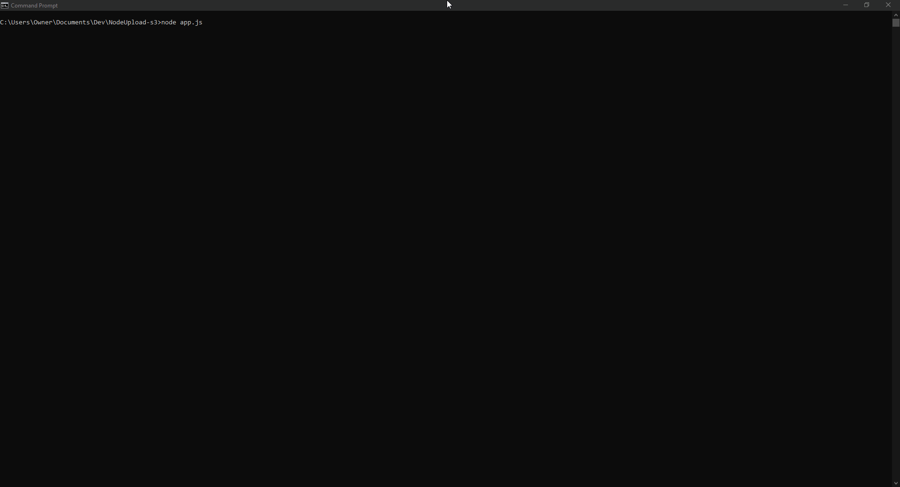

# NodeUpload S3

NodeUpload S3 is a version of NodeUpload that allows you to use S3 to store files.

###### (Yeah, not the best name but I can't think of good names)
Decided to start from scratch using a different dependency for uploading. Basics are working and I think it is ready for running in a production environment.

## Installing
Should be easy to install and use

```sh
npm install
nano config.json # Configure NodeUpload (you can use something other than nano for this)
node createUser.js # This is the script for creating users
node app.js
```

## Configuration

Rename `config.json.example` to `config.json` and then modify the settings as required:

{
	"filenameLength": 10,
	"port": "8099",
	"indexForm": true,
	"indexFormDisabledMessage": "Hi, this is NodeUpload. The upload form here has been disabled. Change the config file to enable it.",
	"extBlacklist": [".exe", ".sh", ".cmd", ".bat", ".html", ".htm"],
	"ratelimitAfter": 5,
	"ratelimitTime": 7500,
	"logs": {
		"enable": false,
		"dir": "logs",
		"file": "NodeUpload_log.txt",
		"format": "{{ time }} | {{ log }} \n"
	},
	"s3": {
		"bucket": "",
		"s3_endpoint": "",
		"s3_accessKeyId": "",
		"s3_secretAccessKey": "",
		"s3_region": "",
		"remotePath": "",
		"redirectToAfterUpload": ""
	}
}

| Option | Description | Required |
|---     |---          |---       |
| filenameLength | How long the generated file name will be | [x] |
| port | The port that NodeUpload S3 runs on | [x] |
| indexForm | If the online upload form should be shown | [x] |
| indexFormDisabledMessage | The message that is shown if the online upload form is disabled | [] |
| extBlacklist | Files with these extensions will not be allowed | [x] |
| ratelimitAfter | After this many requests in the `ratelimitTime`, rate limit requests | [x] |
| ratelimitTime | See `ratelimitAfter` description | [x] |
| logs.enable | If logs are enabled | [x] |
| logs.dir | The directory that logs will be saved in | []* |
| logs.file | The file that logs will be saved in | []* |
| logs.format | Log format | [x] |
| s3.bucket | S3 bucket | [x] |
| s3.s3_endpoint | S3 endpoint | [x] |
| s3.s3_accessKeyId | S3 access key | [x] |
| s3.s3_secretAccessKey | S3 secret key | [x] |
| s3.s3_region | S3 region | [x] |
| s3.remotePath | If you want the files to be uploaded to a different folder on S3 | [] |
| s3.redirectToAfterUpload | If you want users to be redirected to the URL of their file, insert that URL here | [] |

* These are required if `logs.enable` is set to `true`

## Creating a New User
After you are done installing and your friends also want to upload files, run the following command and answer the questions.

```sh
node createUser.js
```

## Usage

If the server is not already started, run `node app.js`.
Once the server has started, open a web browser to `YOUR_IP:PORT` (where `PORT` is the port specified in the config file (`config.json`)).

If everything worked, it should show an upload form (unless disabled in the config file). Just add your token where it says `Token`, choose a file to upload, then click the button. It should upload. If not, check the console for errors. You may need to open an issue here.



Some file extensions are blacklisted by default. These can be changed in the config file.
- .exe
- .html
- .htm
- .bat
- .cmd
- .sh

## FAQs

  > What is this?

  NodeUpload is a Node.js server application that lets you run your own private file upload service. It uses randomly generated tokens for upload authentication.

  > Does it have support for ShareX?

  Yes it does! Please look at [the ShareX section of the docs](https://nodeupload.ndt3.me/#sharex-configuration) for more details.

  > How are uploads done?

  When a user uploads a file, it will be stored in a directory in your operating system's temp directory. Then there will be a connection to the database to check that the token is valid. If it is valid, the file gets moved to the `files` directory in the app's directory.

  > How are tokens generated?

  Tokens generated are not based on any information given when running `createUser.js`. The information there is only used to be stored in the database. The token is generated by the [`uuid` module](https://www.npmjs.com/package/uuid) (`uuid/v4`) to generate a completely random token.

  > Does it check for information already existing in the database when running `createUser.js`?

  Yes, this feature has been added.

  > Is there any way to change the port that it runs on?

  To change the port that NodeUpload runs on, edit the config file (`config.json`).

  > Is there any way to change the length of the generated file names of uploads?

  To change the length of the auto generated file names of uploads, edit the config file (`config.json`).

  > Is there any way to change the responses (console output, web responses, etc.)?

  Yes, there is. Edit the `strings.json` file. The placeholders (`{{placeholder}}`) in these cannot be used in all strings. The code will have to be changed if you want to add these into strings that do not have support for it. Note that not all strings can be changed. Please see [the docs](https://nodeupload.ndt3.me) for more details.

  > Can I contribute to the development of NodeUpload by opening pull requests?

  Yes, you can open a pull request but please use the format [here](https://github.com/NdT3Development/nodeupload/blob/master/PULL_REQUESTS.md)

  > I found a bug, how do I report it?

  To report a bug, open an issue using the format [here](https://github.com/NdT3Development/nodeupload/blob/master/BUGS.md)

  > Can I request a feature?

  Yes, I am open to feedback and feature requests. Just open an issue using the format [here](https://github.com/NdT3Development/nodeupload/blob/master/FEATURE_REQUESTS.md)

## LICENSE
MIT License

Copyright (c) 2020 NdT3Development

Permission is hereby granted, free of charge, to any person obtaining a copy
of this software and associated documentation files (the "Software"), to deal
in the Software without restriction, including without limitation the rights
to use, copy, modify, merge, publish, distribute, sublicense, and/or sell
copies of the Software, and to permit persons to whom the Software is
furnished to do so, subject to the following conditions:

The above copyright notice and this permission notice shall be included in all
copies or substantial portions of the Software.

THE SOFTWARE IS PROVIDED "AS IS", WITHOUT WARRANTY OF ANY KIND, EXPRESS OR
IMPLIED, INCLUDING BUT NOT LIMITED TO THE WARRANTIES OF MERCHANTABILITY,
FITNESS FOR A PARTICULAR PURPOSE AND NONINFRINGEMENT. IN NO EVENT SHALL THE
AUTHORS OR COPYRIGHT HOLDERS BE LIABLE FOR ANY CLAIM, DAMAGES OR OTHER
LIABILITY, WHETHER IN AN ACTION OF CONTRACT, TORT OR OTHERWISE, ARISING FROM,
OUT OF OR IN CONNECTION WITH THE SOFTWARE OR THE USE OR OTHER DEALINGS IN THE
SOFTWARE.
